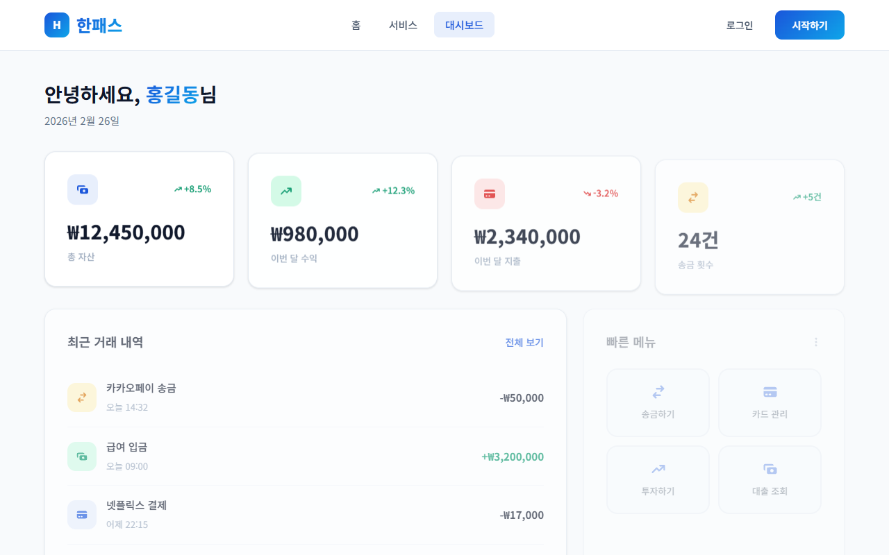

# 한패스 (HanPass) — 스마트 핀테크 플랫폼

> 간편 송금 · 자산 관리 · 투자 · 대출을 하나의 플랫폼에서 경험하세요.

---

## 스크린샷

| 홈 페이지 | 로그인 |
|---|---|
|  |  |

| 대시보드 | 서비스 소개 |
|---|---|
|  |  |

---

## 기술 스택

### 코어

| 기술 | 버전 | 역할 |
|---|---|---|
| **React** | 19.2.0 | UI 라이브러리 |
| **Vite** | 7.3.1 | 빌드 도구 / 개발 서버 |
| **React Router DOM** | 7.13.0 | 클라이언트 사이드 라우팅 |

### 스타일링

| 기술 | 버전 | 역할 |
|---|---|---|
| **styled-components** | 6.3.9 | CSS-in-JS 컴포넌트 스타일링 |
| **Tailwind CSS** | 4.1.18 | 유틸리티 클래스 스타일링 |
| **Noto Sans KR** | — | 한글 웹폰트 (Google Fonts) |

### 기타

| 기술 | 버전 | 역할 |
|---|---|---|
| **react-icons** | 5.5.0 | 아이콘 라이브러리 |
| **ESLint** | 9.39.1 | 코드 품질 검사 |

---

## 프로젝트 구조

```
src/
├── components/
│   ├── Header.jsx        # 네비게이션 헤더 (sticky, 반응형)
│   └── Footer.jsx        # 푸터 (4열 그리드)
├── pages/
│   ├── HomePage.jsx      # 메인 홈 (히어로, 기능 소개, CTA)
│   ├── LoginPage.jsx     # 로그인 (이메일 / 소셜)
│   ├── DashboardPage.jsx # 대시보드 (자산 통계, 거래 내역)
│   └── ServicesPage.jsx  # 서비스 소개 + 요금제
├── styles/
│   └── SharedStyles.js   # 공용 컴포넌트 (Button, Card, 애니메이션 등)
├── App.jsx               # 라우터 설정
├── index.css             # Tailwind + 전역 CSS 변수
└── main.jsx              # 앱 진입점
```

---

## 라우팅

| 경로 | 페이지 | 설명 |
|---|---|---|
| `/` | HomePage | 메인 랜딩 |
| `/login` | LoginPage | 로그인 / 회원가입 |
| `/dashboard` | DashboardPage | 사용자 대시보드 |
| `/services` | ServicesPage | 서비스 소개 및 요금제 |

---

## 반응형 브레이크포인트

| 구간 | 기준 |
|---|---|
| Desktop | 1024px 이상 |
| Tablet | 768px ~ 1024px |
| Mobile | 480px 이하 |

---

## 실행 방법

```bash
# 패키지 설치
npm install

# 개발 서버 (http://localhost:5173)
npm run dev

# 프로덕션 빌드
npm run build

# 빌드 결과 프리뷰
npm run preview
```

---

## 빌드 결과

| 파일 | 크기 | gzip |
|---|---|---|
| `index.html` | 0.77 kB | 0.47 kB |
| `assets/index.css` | 7.25 kB | 2.09 kB |
| `assets/index.js` | 304.98 kB | 96.83 kB |

---

## 라이선스

Copyright (c) 2026 heralife — **무단배포 금지**
자세한 내용은 [LICENSE](LICENSE) 파일을 참고하세요.
